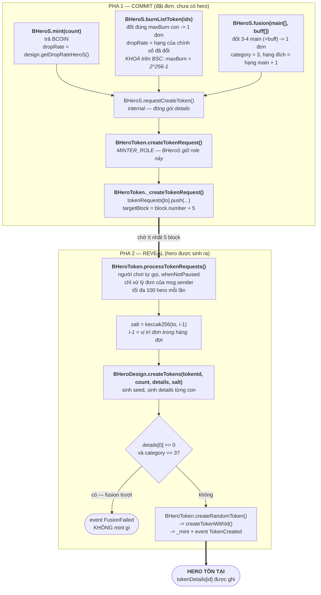
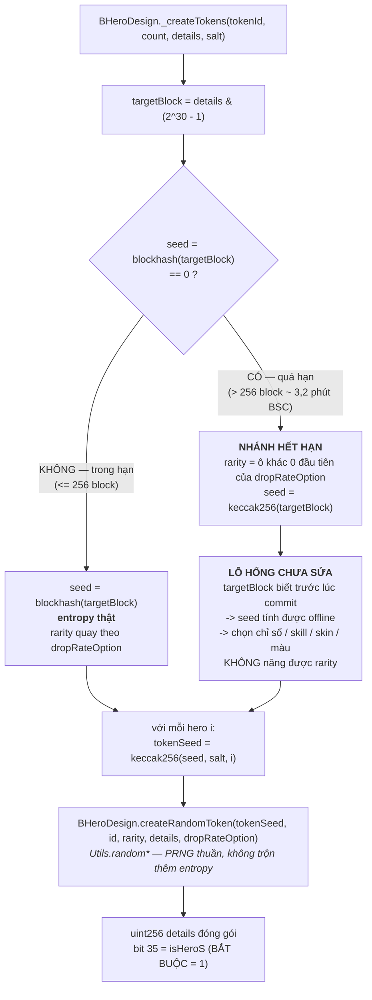
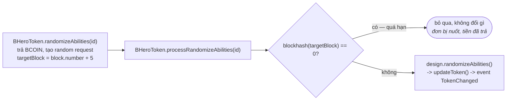

# Sơ đồ các hàm tạo ra BHero — đường của người chơi

Chỉ tính những gì **người chơi tự gọi được**. Các đường phát hero do máy chủ/hệ thống khởi tạo
(`claimHero`, `claimHeroS`, `ClaimManage`, `BHeroClaim`, `createTokenRequest` gọi thẳng bằng
`MINTER_ROLE`) không nằm trong sơ đồ này.

Mọi hero đều sinh ra qua **một cơ chế commit–reveal hai pha duy nhất**. Không có đường mint tức thì:
`createToken` (mint ngay) đã bị comment-out trong `BHeroToken.sol`.

| Pha | Việc xảy ra |
|---|---|
| **COMMIT** | Ghi một `CreateTokenRequest` vào `tokenRequests[to]`, chốt `targetBlock = block.number + 5` |
| **REVEAL** | `processTokenRequests()` lấy `blockhash(targetBlock)` làm seed, sinh details, `_mint` |

Giữa hai pha, hero **chưa tồn tại** — chỉ có một dòng trong hàng đợi.

---

## 1. Toàn cảnh

Ba đường vào, cả ba đều nằm trong `BHeroS`. **Chỉ `mint` là tạo hero mới thật sự** — `burnListToken`
và `fusion` đều phải đốt hero sẵn có làm nguyên liệu.

---

## 2. Chi tiết pha REVEAL — chỗ sinh ngẫu nhiên

**Vì sao `salt` quan trọng.** Trước bản vá 26/08, salt lấy theo `to` (địa chỉ ví). Hai đơn `count=1`
của cùng một ví rơi vào cùng một block thì `targetBlock`, `salt`, `i` đều trùng → mint ra hero
**giống hệt nhau từng bit**. Nay salt lấy theo **vị trí đơn trong hàng đợi** (`i - 1`), gán lúc
`push` và chỉ mất đi khi `pop()` từ đuôi → cố định từ lúc commit, không grind được bằng cách chọn
thời điểm reveal.

---

## 3. Bảng tra nhanh

| Hàm | Contract | Điều kiện | Hero ra | Rarity quyết định bởi |
|---|---|---|---|---|
| `mint(count)` | BHeroS | trả BCOIN | `count` | `design.getDropRateHeroS()` |
| `burnListToken(ids)` | BHeroS | sở hữu + `length == maxBurn` | 1 | hạng của số đã đốt (giữ nguyên hạng) |
| `fusion(main, buff)` | BHeroS | sở hữu + 3–4 main cùng hạng | 1 | 4 main = 100% lên 1 hạng; 3 main = 75% + buff |
| `processTokenRequests()` | BHeroToken | `whenNotPaused` | tối đa 100 | đã chốt từ lúc commit |

Hai đường **đốt** hero của người chơi đều nằm trong `BHeroS` (`burnListToken`, `fusion`) và đi qua
`BHeroToken.burn(ids)` — `BHeroS` giữ `BURNER_ROLE` nên đốt được nguyên liệu của chính người gọi.

---

## 4. Nhánh phụ — không tạo hero mới, chỉ sửa hero sẵn có

Cùng khuôn commit–reveal, nhưng nhánh hết hạn ở đây **không** sinh kết quả — chỉ huỷ đơn. Đây là
điểm khác biệt so với `createTokens`, nơi nhánh hết hạn vẫn mint (và chính vì vẫn mint nên nó thành
lỗ hổng).

---

## 5. Điểm cần nhớ

1. **Không có đường mint tức thì.** Mọi hero đều đi qua `processTokenRequests()`. Muốn dừng toàn bộ
   việc sinh hero, chỉ cần `pause()` — modifier `whenNotPaused` đã được thêm vào hàm này ngày
   26/08/2026 (trước đó `pause()` là hàm chết).
2. **Cả ba đường vào đều đi qua `BHeroS`,** contract giữ `MINTER_ROLE` trên `BHeroToken`. Thu hồi
   role đó là đóng cùng lúc `mint`, `burnListToken` và `fusion` — một giao dịch, không cần upgrade.
3. **`processTokenRequests` cắt ở 100 hero mỗi lần**, và biến đếm `i` khởi động lại từ 0 ở lần gọi
   sau → đơn `count > 100` bị lặp lại kết quả giữa các lô. Chỉ thiệt cho người giữ đơn, không cho ai
   lợi thế (xem `incident-2026-08-26/HANDOVER.md` mục 3.5).
4. **Đường nào chạm được vào lỗ hổng nhánh hết hạn.** Nhánh hết hạn ghim rarity về **ô khác 0 đầu
   tiên** của `dropRateOption`. Đơn nào có vector drop rate **chỉ một ô khác 0** thì bị ghim đúng vào
   hạng lẽ ra sẽ nhận → chờ hết hạn **không mất gì**, quay lại miễn phí bao nhiêu lần cũng được:

   | Đường | Vector drop rate | Hết hạn thì sao |
   |---|---|---|
   | `fusion` 4 main | chỉ 1 ô khác 0 (100% ở hạng đích) | **không phạt** — đường tiếp cận đang mở |
   | `burnListToken` | chỉ 1 ô khác 0 (5 con cùng hạng) | **không phạt** — đã khoá trên BSC, **còn mở trên Polygon** |
   | `fusion` 3 main | ô 0 = phần trượt, ô đích = phần trúng | bị ghim về common — có phạt |
   | `mint` | nhiều ô khác 0 | bị ghim về hạng thấp nhất — có phạt |

   Tức `burnListToken` **không** vô hại trên Polygon như lập luận "5 ăn 1 luôn lỗ": nó vẫn là cửa vào
   lỗ hổng y hệt `fusion` 4 main.
