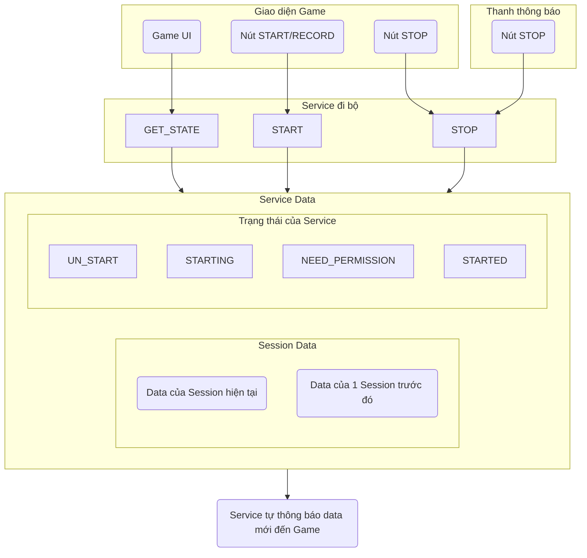

# Sơ đồ và mô tả Service Đi Bộ

---

## 📌 Ghi chú chi tiết

### 🧩 Các phương thức của `Service đi bộ`:
- `START`: Bắt đầu ghi 1 Session đi bộ mới.
- `STOP`: Dừng Session hiện tại.
- `GET_STATE`: Lấy `Service Data`, bao gồm:
    - Trạng thái (`STATE`)
    - Dữ liệu Session hiện tại (nullable)
    - Dữ liệu Session trước đó (nullable)

### 🚦 Trạng thái (`STATE`) gồm:
- `UN_START`: Đang ko làm gì cả.
- `STARTING`: Đang khởi động. Có thể dẫn đến `NEED_PERMISSION` hoặc `STARTED`.
- `NEED_PERMISSION`: Thiếu quyền, cần xin quyền.
- `STARTED`: Đang record Session.

### 📊 Dữ liệu 1 `Session` bao gồm:
- `Session ID`: số tăng dần từ 1.
- `Thời điểm bắt đầu`.
- `Thời điểm kết thúc` (nullable - nếu là Session hiện tại sẽ ko có thông tin này này).
- `Số bước đã đi`.
- `Số km`: = số bước × 0.6m.
- `Số giây đã đi` từ lúc bắt đầu.

### 📱 Cách sử dụng:
- Khi chuẩn bị sử dụng tính năng, gọi `GET_STATE` để lấy:
    - Trạng thái:
        - Nếu `UN_START`: hiển thị nút Record → gọi `START`.
        - Nếu `STARTED`: hiển thị nút Stop → gọi `STOP`.
        - Nếu `NEED_PERMISSION`: hiển thị nút xin quyền → gọi `START`, hệ thống sẽ tự động xin quyền.
    - Dựa vào `Session Data` hiện tại và trước đó để tính toán & hiển thị thông tin phù hợp.

### 🔁 Trong quá trình sử dụng:
- Service sẽ tự thông báo khi `Session Data` thay đổi (UI có thể cập nhật theo).

### 🌙 Khi thoát game:
- Service vẫn hoạt động nền.
- Nếu người dùng bấm `STOP` trong thanh thông báo Android → `STOP` Session hiện tại.
- Muốn Record Session mới, cần mở lại game và gọi `START`.
