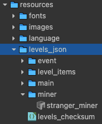

# [GM7] Hệ thống Level định dạng JSON & Level Cloud Sync & Level Remote Override

## Hệ thống Level định dạng JSON:
Thay cho kiểu level cũ (dùng prefab) -> Nay đã convert qua JSON.
### Vị trí:  
Thư mục: `assets/resources/levels_json`, gồm có:
- `/event`: thư mục chứa các level của Event
- `/main`: thư mục chưa các level của Story
- `/level_item`: các prefab sẽ sử dụng để liên kết trong các file json
- `/miner`: các prefab sẽ sử dụng để liên kết trong các file json
- `levels_checksum.json`: file tổng hợp các level sẽ sử dụng trong game.  

Chú thích cách đặt tên file:
- `mode_0_area_1_lv_1.json`: Story - Area 1 - Level 1
- `mode_1_area_1_lv_1.json`: Event - Area 1 - Level 1
- `mode_0_area_1_lv_1_123456.json`: Story - Area 1 - Level 1 - variant 123456

(Area & Level có số tối thiểu là 1)

### Để edit level:
Vào menu `Level Editor > Open Panel`  
  
Có thể kéo thả Editor Window vào các Tab trong Editor cho tiện sử dụng
  
Để mở 1 level thì sử dụng 1 trong 2 cách như trong hình (Nhập số hoặc kéo thả file JSON vào) rồi bấm Open Level  
Sau khi lưu level (Ctrl+S cho Window hoặc Cmd+S cho MAC), hệ thống sẽ tự lưu file xuống thư mục `assets/resources/levels_json/event` hoặc `assets/resources/levels_json/main`.  
Nhưng hệ thống sẽ không replace file cũ mà tạo 1 file mới với 1 dãy số đằng sau.  
  
Dãy số này gọi là `variant` (mục đích giải thích sau)  
Nhưng trong trường hợp muốn replace luôn file level cũ thì cứ rename thủ công

Sau khi hoàn tất mọi công việc, bấm nút `Upload toàn bộ levels lên Cloud`.
Hệ thống sẽ tự generate ra 1 file `levels_checksum.json` mới và copy toàn bộ file có trong thư mục `assets/resources/levels_json/event` hoặc `assets/resources/levels_json/main` lên Server.
Việc này để phục vụ cho Level Cloud Sync.

## Level Cloud Sync:
Để đồng bộ các file level JSON giữa Game Client và Server

### Cách hoạt động:
#### Đối với Users (Gameplay):
Khi vừa mở game, hệ thống sẽ `âm thầm` kết nối đến server và kiểm tra sự khác biệt giữa các file level JSON trên Game Client và Server.  
Khi có sự khác biệt, hệ thống sẽ tự động download file mới nhất từ Server về Game Client.  
Nếu không thể tải được file mới, hoặc có vấn để dẫn đến file ko tồn tại. Game sẽ `dùng file mặc định` đi kèm theo bản build.
Nếu trước đó đã từng tải file mới rồi (v1), nay có file mới hơn nữa (v2), nhưng có sự cố (như trên đã nói), thì hệ thống sẽ dùng file (v1) đó thay cho file mặc định đi kèm theo bản build.

Lưu ý: Chưa xử lý trường hợp file level mới không tương thích với Game Client (ví dụ nếu về sau có bổ sung thêm nhiều tính năng khác trong level mà Game Client version cũ không thể support được).  

#### Đối với Dev/Designer:
- Địa chỉ server: `http://192.168.1.102/gm7`
- Thư mục chứa các file levels: `https://test1.bombcrypto.io/vfile/files/web/gm7/levels_test/` (liên hệ Dev lấy mật khẩu)

Giải thích về file `levels_checksum.json`:
- File này tổng hợp các file Level JSON & mã Hash của chúng.
- Để so sánh các level có sự thay đổi hay ko, hệ thống sẽ so sánh mã Hash.
- Khi vào game, hệ thống sẽ tải file `levels_checksum.json` của Server & so sánh với file `levels_checksum.json` của Game Client đang có.
- Nếu có mã Hash nào ko trùng khớp, hoặc số lượng mã Hash ko khớp, hệ thống sẽ download file bị thiếu hoặc bị thay đổi.
- Hệ thống lưu lại file levels_checksum.json mới.  

## Level Remote Override:
Tính năng Level Cloud Sync hoạt động tốt cho việc replace các file Level JSON trùng tên.  
Tính năng Level Remote Override phục vụ thêm cho những trường hợp cần test level hoặc A/B Testing hoặc Remote Config Conditional.

Ví dụ:
- Mặc định user sẽ được chơi level: `mode_0_area_1_lv_1.json`
- Nhưng user ở US sẽ chơi level: `mode_0_area_1_lv_1_123456.json`

Để làm được điều đó, đầu tiên phải Upload lên Server tất cả những file levels & checksum cần thiết.  
Sau đó sử dụng Editor để chỉ định file level nào cần Override: http://192.168.1.102:8106/gm7/web  

Dựa vào các file Levels JSON đã Upload lên Server, trang web sẽ cho các option để lựa chọn level variant (nếu có)

### Giải thích các chức năng của Panel Level Override JSON:
Gồm 3 nút:
- Gửi lên Server: Server sẽ lưu lại các level muốn Override (nhưng chỉ có tác dụng đối với `Game Client Test`)
- Xoá bộ nhớ: Chỉ xoá ở session hiện tại (ko lưu lên Server)
- Copy JSON: Copy nội dung JSON ra clipboard để paste vào Firebase Remote Config

### Cách hoạt động:
Game Client sẽ phân biệt ra 2 loại thiết bị như sau:
- Thiết bị Test: (Nếu có cài Cheat Tool & chọn Option Test level override)
- Thiết bị của User: ...

#### Đối với thiết bị Test:
Game Client sẽ sử dụng Level Override của Server (được set trực tiếp trên trang web) thay cho Firebase Remote Config.   
#### Đối với thiết bị của User:
Game Client sẽ sử dụng key `levels_override` được set trên Firebase Remote Config.  

### Tổng kết lại: 
- Thay đổi Level Override trên trang web sẽ `không ảnh hưởng gì đến User`.
- Muốn thay đổi cho User thì `set thủ công trên Firebase Remote Config`.

# Dùng cho Dev:
- Code Editor Window: `packages/level_editor`
- Scene Level Editor: `assets/scenes/level_generate_from_json.fire`
- Code Level Cloud Sync: `assets/scripts/manager/level/LevelCloudSyncer.ts`
- Scene Level Cloud Sync: `assets/scenes/cloud_sync_test.fire`
- Code Level Remote Override: `assets/scripts/manager/level/LevelLoaderManager.ts`