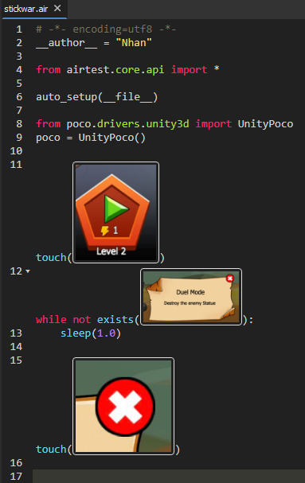

# Poco Air Test

Chức năng hỗ trợ Automated Testing cho nhiều hệ thống khác nhau

## 1. Cài đặt:
Tải Airtest IDE tại: https://airtest.netease.com/  
Link git (tham khảo): https://github.com/AirtestProject/Airtest && https://github.com/AirtestProject/Poco 

Sau khi tải về, run file AirtestIDE.exe (Windows) để khởi động.  
Chương trình sẽ yêu cầu đăng nhập, hãy click chọn tạo tải khoản AirLab.  

### 1.1. Giao diện cơ bản:

Connect thiết bị với Airtest:  
  

Có thể connect thông qua wifi (tùy chọn):  
  

Sau khi connect thành công, streaming sẽ được hiển thị trên màn hình:  
  

**Trong trường hợp connect không thành công:**
- Thử Revoke USB Debugging Authorization
- Rút dây và cắm lại
- Set chế độ kết nối `chỉ sạc`

### 1.2. Cách hoạt động:
Airtest & Poco hoạt động theo 2 cách:
- Nhận diện hình ảnh (không cần tích hợp thư viện vào game)
- Gọi trực tiếp code trong Unity (cần tích hợp thư viện vào game)

Thông qua 1 trong 2 cách trên, chúng ta sẽ viết script bằng `Python` để giao tiếp với game.  
Chỉ cần sử dụng các cú pháp cơ bản của Python:
- if `điều kiện`:
- for i in range(`5`):
- while `điều kiện`:
- ...

Và các cú pháp riêng của Airtest cung cấp:
- touch(`gì đó`)
- swipe(`gì đó`)
- sleep(`1.5`)
- exist(`điều kiện`)
- ...

Cơ bản về cú pháp của Python:
- Các lệnh ngăn cách với nhau bằng dấu `xuống hàng`
- Các lệnh lồng nhau bằng dấu `Tab`

### 1.3. Viết script cơ bản:

Nhấp vào nút `Record` (nút bên phải) để bắt đầu ghi lại các thao tác trên màn hình.  
Hoặc nhấp vào nút `Screenshot` (nút bên trái) để chụp lại hình cần thao tác.  

---

Ví dụ:  

Giải thích script:
1. Nhấp vào nút `Play`
2. Đợi 1 giây
3. Bấm vào nút `X`
4. Đợi 1 giây
5. Bấm vào nút `Lính kiếm` 100 lần
6. ...

---

#### Ví dụ khác về code phức tạp hơn:  

Giải thích script:
1. Nhấp vào nút `Play`
2. Nếu hình này chưa xuất hiện thì chờ 1 giây rồi lặp lại
3. Bấm vào nút `X`

---

#### Để chạy script:
Trở lại màn hình game ban đầu và nhấp vào nút `Play` trên Airtest:  

---

Lưu lại file script để dùng cho lần sau.  
File script ví dụ: https://drive.google.com/file/d/1Vk0FhsdgCIYWSaDUjObnrb0MkjVDIq0Z/view?usp=sharing

---

## 2. Tích hợp nâng cao cho Unity:
Bổ sung sau: https://airtest.doc.io.netease.com/en/tutorial/11_test_Unity3D_game/
