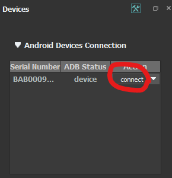
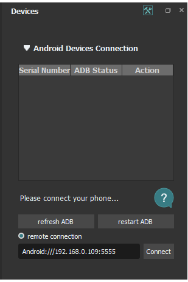
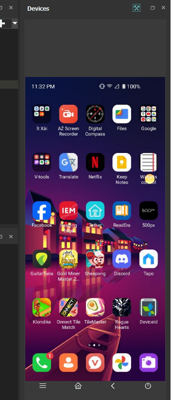
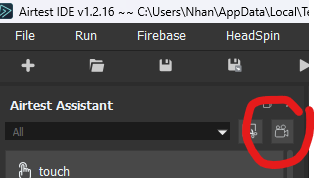
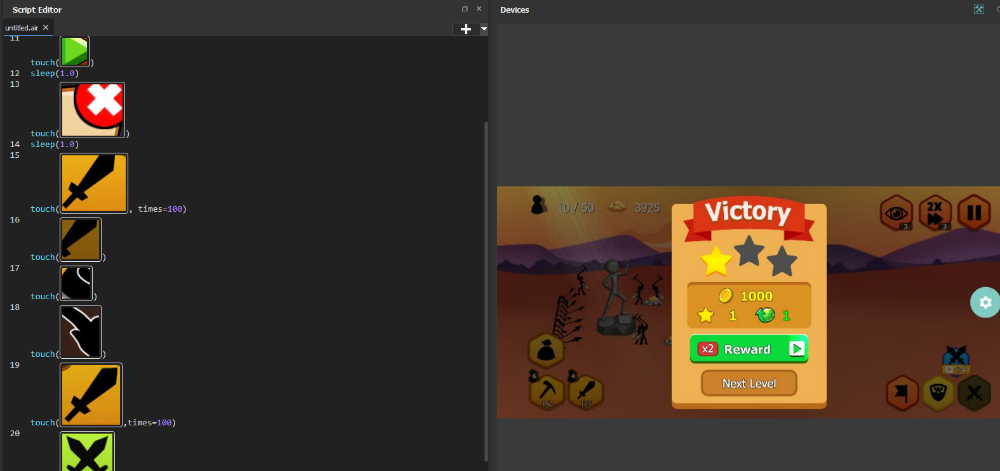
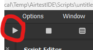

# Poco Air Test

Chức năng hỗ trợ Automated Testing cho Unity

## 1. Cài đặt:
Tải Airtest IDE tại: https://airtest.netease.com/  
Link git: https://github.com/AirtestProject/Poco

Sau khi tải về, run file AirtestIDE.exe (Windows) để khởi động.  
Chương trình sẽ yêu cầu đăng nhập, hãy click chọn tạo tải khoản AirLab.  

### 1.1. Giao diện cơ bản:

Connect thiết bị với Airtest:  
  

Có thể connect thông qua wifi:  
  

Sau khi connect thành công, streaming sẽ được hiển thị trên màn hình:  
  

**Trong trường hợp connect không thành công:**
- Thử Revoke USB Debugging Authorization
- Rút dây và cắm lại
- Set chế độ kết nối `chỉ sạc`

### 1.2. Chế độ ghi lại màn hình:

Nhấp vào nút `Record` để bắt đầu ghi lại các thao tác trên màn hình.

Sau khi ghi lại được các thao tác, có thể chỉnh sửa script theo ví dụ bên dưới:

Giải thích script:
1. Nhấp vào nút `Play`
2. Đợi 1 giây
3. Bấm vào nút `X`
4. Đợi 1 giây
5. Bấm vào nút `Lính kiếm` 100 lần
6. ...

Để chạy script, trở lại màn hình game ban đầu và nhấp vào nút `Play` trên Airtest:

Lưu lại file script để dùng cho lần sau.

## 2. Hỗ trợ Unity:
Bổ sung sau: https://airtest.doc.io.netease.com/en/tutorial/11_test_Unity3D_game/
