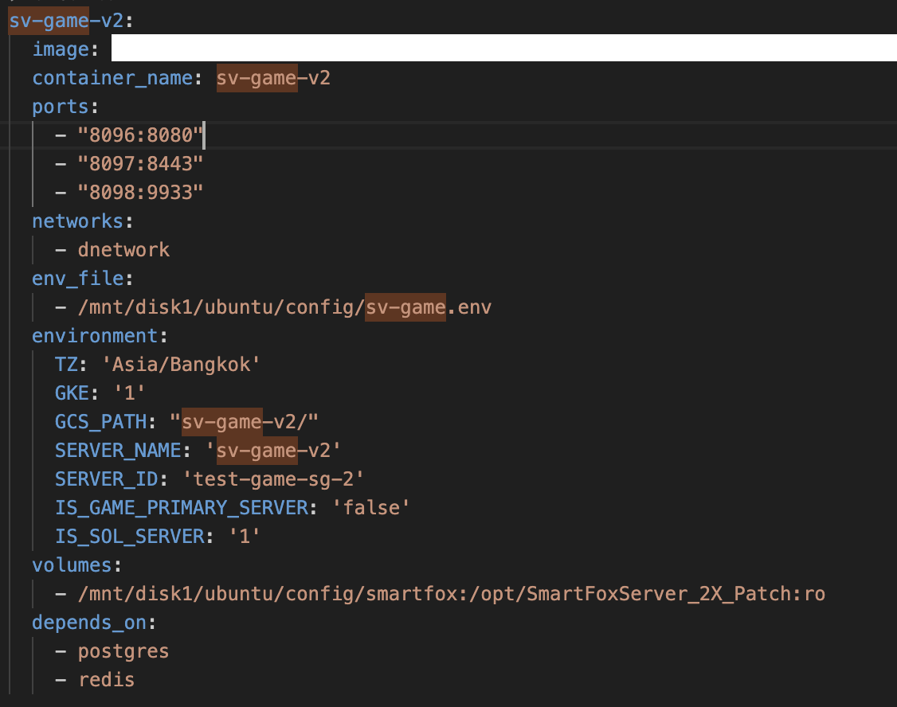

# Docker Server công ty

Tất cả Services của Server được vận hành bởi các file sau đây:
- `compose.yaml`
- `compose.override.yaml`

Nếu Smartfox, thì gồm cả:
- `sv-game.env` : File env dùng chung cho 4 server smartfox của công ty

Nếu muốn sửa Env của 1 Services bất kỳ, ví dụ: `sv-game-v2`

- Sửa trong file `sv-game.env`: Nếu muốn áp dụng chung cho tất cả các server smartfox
- Sửa trong phần environment: Nếu muốn chỉ áp dụng riêng cho `sv-game-v2`
  - Ví dụ:
  - Sửa IS_SOL_SERVER thành '0'
  - Thêm IS_TON_SERVER = '1'
  - Xoá IS_GAME_PRIMARY_SERVER
- Sau khi sửa xong, cần build lại service đó, ví dụ:
  - ssh vào máy công ty
  - `cd /mnt/disk1/ubuntu/config`
  - `docker compose up -d --build sv-game-v2`

