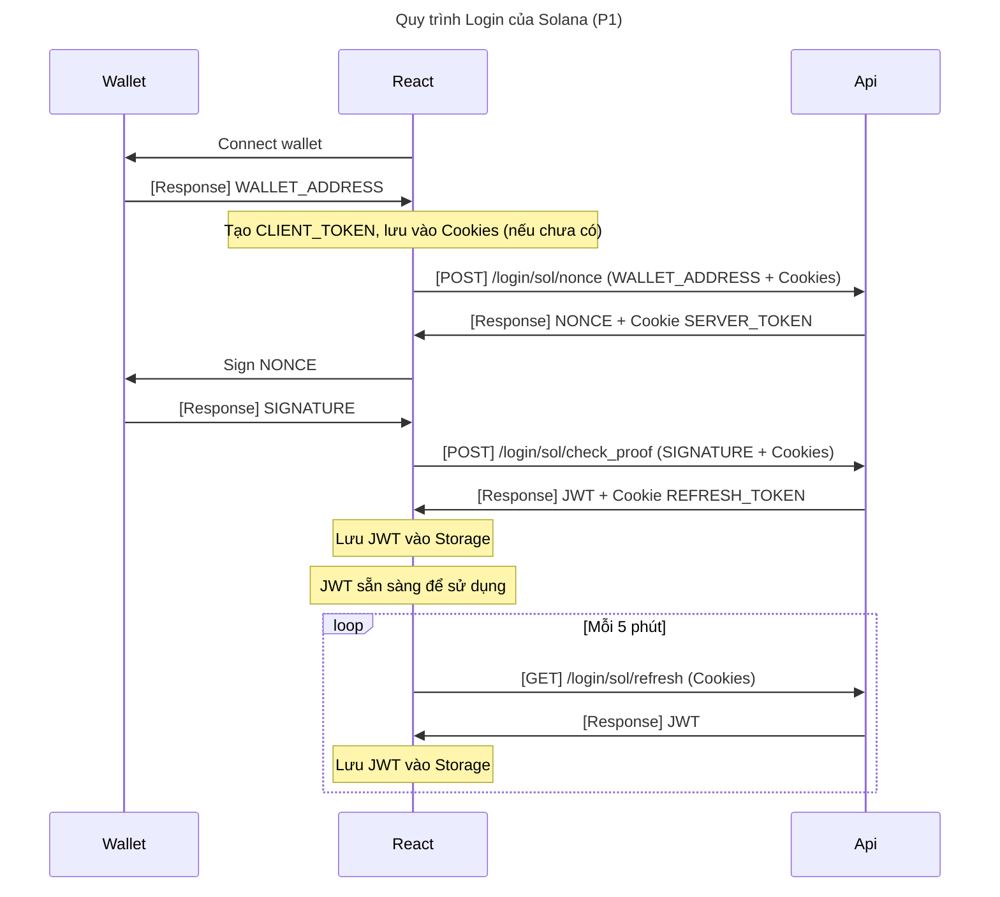
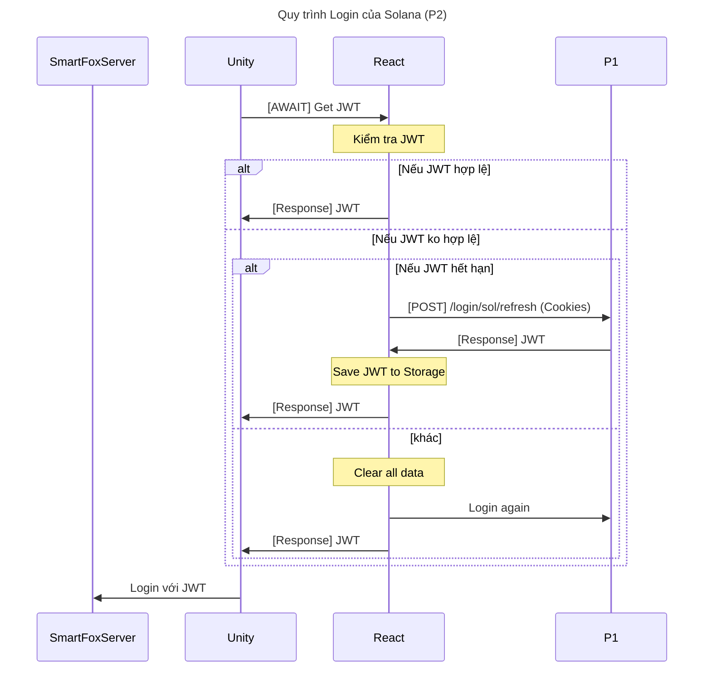

# Tóm tắt:
- Giao tiếp giữa Unity & React & SmartFox Server được mã hoá.
- Login vào SmartFox cần có: JWT & PublicKey từ Api Server.

## Quy trình P1: giao tiếp giữa React & Api
1. Khi web vừa khởi động, React Connect Wallet.
2. React gửi yêu cầu lấy NONCE từ Api.
3. React yêu cầu Wallet ký NONCE.
4. React gửi SIGNATURE đến Api để xác thực & lấy JWT.
5. JWT có lifetime chỉ 30 phút, mỗi 5 phút, React phải yêu cầu làm mới JWT.
6. React lưu JWT vào Storage để sử dụng.
7. Với JWT hợp lệ, tắt Browser mở lại thì ko cần phải ký Wallet nữa, nhưng sẽ gọi làm mới JWT.

## Quy trình P2: giao tiếp giữa Unity & React:
1. Khi Unity vừa khởi động, Unity gửi yêu cầu lấy JWT -> React & chờ kết quả.
2. Nếu JWT hợp lệ: React return JWT -> Unity.
3. Nếu JWT hết hạn: React refresh JWT.
4. Nếu ko đủ điều kiện để refresh JWT: React xoá hết data, & login lại từ đầu theo quy trình P1.
5. Sau khi Unity đã có JWT, Unity tự Login vào Smartfox.
6. Trong quá trình chơi game, nếu Unity muốn login lại (Reconnect), thì vẫn phải theo quy trình này từ bước 1.
7. Đối với UnityEditor: sẽ gọi api /login/sol/editor_get_jwt để lấy trực tiếp JWT mà ko cần thông qua quá trình trên.

## Cơ chế giao tiếp giữa Unity & React (Handshake):
Để đảm bảo message giữa Unity & React ko bị nghe lén, phải mã hoá luồng thông tin này:
1. Unity tạo 1 RSA Key Pair, gửi PUBLIC_KEY cho React.
2. React tạo 1 AES key, mã hoá AES_KEY của mình bằng PUBLIC_KEY của Unity, response cho Unity.
3. Unity giải mã bằng PRIVATE_KEY để lấy được AES_KEY.
4. Kể từ thời điểm này, giao tiếp giữa Unity và React sử dụng mã hoá bằng AES_KEY.

Exploit case:
- Nếu Attacker mock PUBLIC_KEY & gửi cho React, Attacker sẽ biết được AES_KEY.
- Nếu Attacker mock AES_KEY & gửi cho Unity, Unity sẽ dùng AES_KEY giả để mã hoá.

## Cơ chế giao tiếp giữa Unity & Smartfox Server:
Để đảm bảo message giữa Unity & Server không thể bị nghe lén, phải mã hoá các message gửi đi và nhận về ở 2 đầu:
1. Cơ chế này hoạt động sau khi đã Handshake giữa Unity & React (để đảm bảo message giữa Unity & React đã mã hoá).
2. React khi REFRESH_JWT_TOKEN, thì Api Server sẽ tạo 1 RSA Key Pair, lưu PRIVATE_KEY vào Redis (TTL 10 phút), gửi PUBLIC_KEY cho React.
3. Khi Unity yêu cầu lấy JWT, React mã hoá JWT bằng PUBLIC_KEY, gửi PUBLIC_KEY & ENCRYPTED_JWT cho Unity.
4. Unity generate 1 AES_KEY, mã hoá LoginData=JSON(AES_KEY, ENCRYPTED_JWT, EXTRA_DATA) bằng PUBLIC để login vào Smartfox.
5. Smartfox gửi LoginData cho Api Server, Api Server trả về AES_KEY & LoginData đã giải mã cho Smartfox.
7. Kể từ thời điểm này, giao tiếp giữa Unity & Smartfox sử dụng mã hoá bằng AES_KEY.

Exploit case:
- Nếu Attacker mock AES_KEY của Unity & gửi cho Smartfox, thì từ đó giao tiếp giữa Unity & Smartfox sẽ bị lộ.

# Thay đổi của Server:
MainGameExtension sẽ ko đăng ký toàn bộ các Handlers/Managers/Services/StreamListeners, mà tuỳ thuộc vào mạng để chia ra 3 Initializer:
- Gồm 3 mạng: Legacy, TON, SOL
- Chia ra đăng ký các Handler cho từng mạng.
- Handler nào đăng ký rồi thì sẽ throw Exception.
- Các StreamListener cũng vậy
- Các Manager/Service sẽ thay đổi lại: chỉ load database nếu Initializer của mạng đó có gọi đến.
- Các Scheduler cũng vậy
- .env bổ sung thêm:
  - IS_SOL_SERVER=1
  - SOL_VERIFY_LOGIN="/login/sol/verify"
