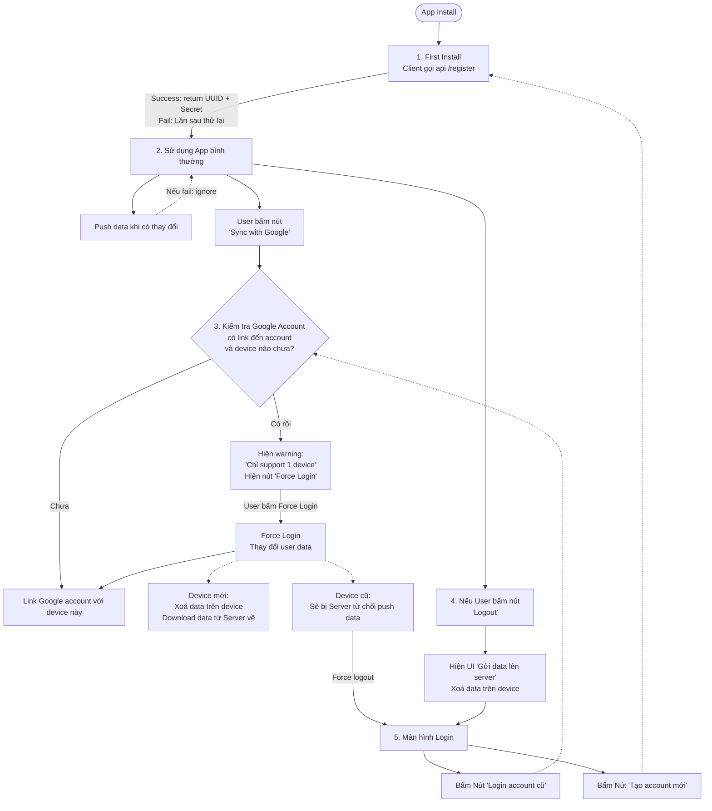

# Client-Server Flow V2



# Client push data:
Client chia data thành các category: Push lên toàn bộ data của category đó theo schema đã quy định sẵn với server, ví dụ:
```
{
    "user_sneakers": [],
    "user_balances": []
    // ...
}
```

Khi client cần data từ Server, client gửi request theo format sau:
```
{
    "request":[
        "user_sneakers",
        "user_balances",
        // ...
    ]
}
```

### Quy định giữa Client & Server:
#### 1. Không được thay đổi JSON schema của category đã quy định, ví dụ:
```
"user_sneakers": [
    "id": "...",
    "speed": "..."
],
```
Nếu phải thay đổi, thay đổi luôn cả key, ví dụ đổi key từ "user_sneakers" → "user_sneakers_v2"
#### 2. Quy định này chỉ để quy định cho giao tiếp qua network, không áp dụng cho cách lưu trữ data của Server và Client


## Các API Endpoint:
- /register: đăng ký lần đầu để có UUID & Secret.
- /login: nếu thông tin login không đúng. Đẩy ra màn hình Login.
- /push: Client push lên data mới.
- /link: Link với Google account.
- /pull: Download data từ server về.
- /leaderboard: Lấy về leaderboard để hiển thị.
