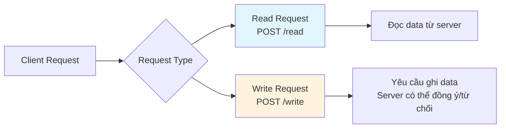
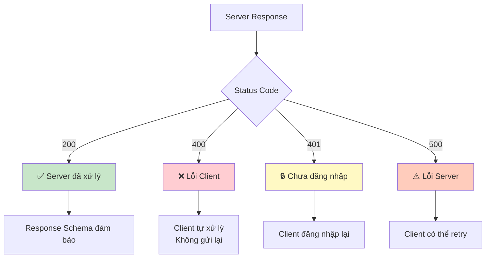
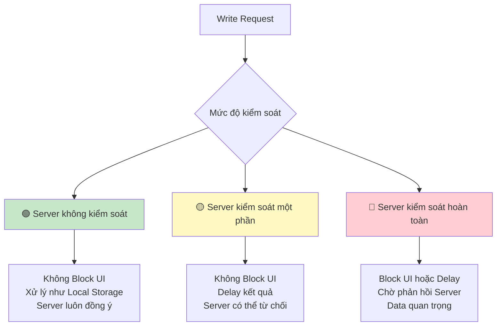
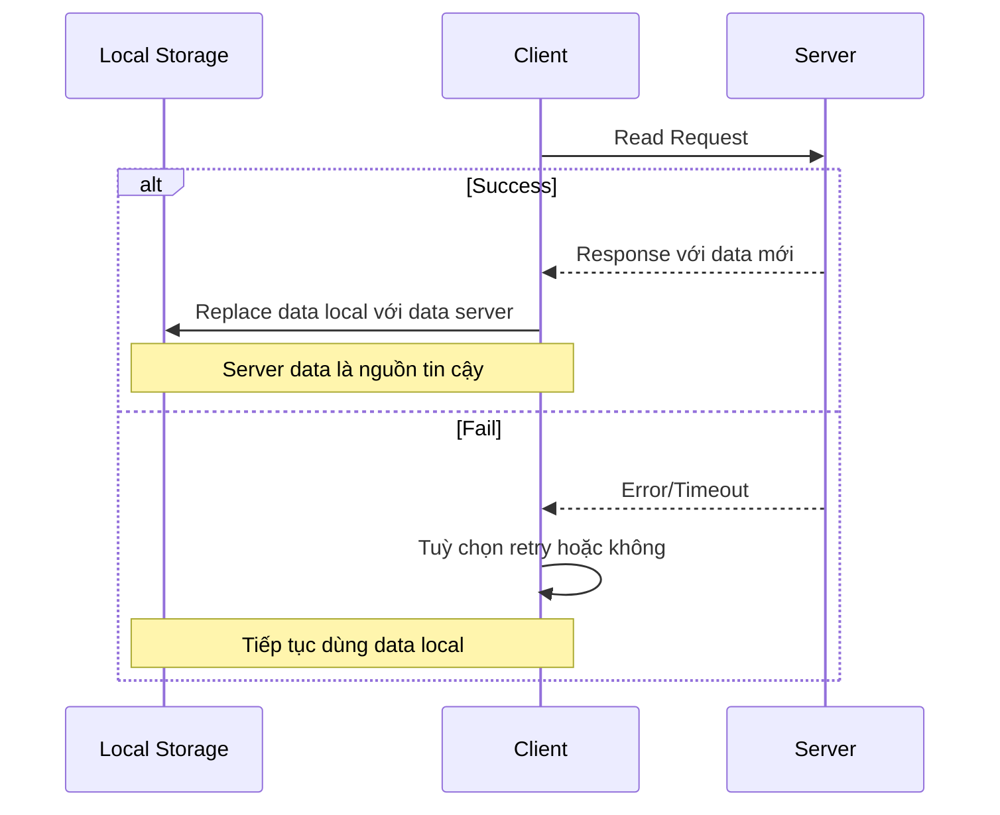
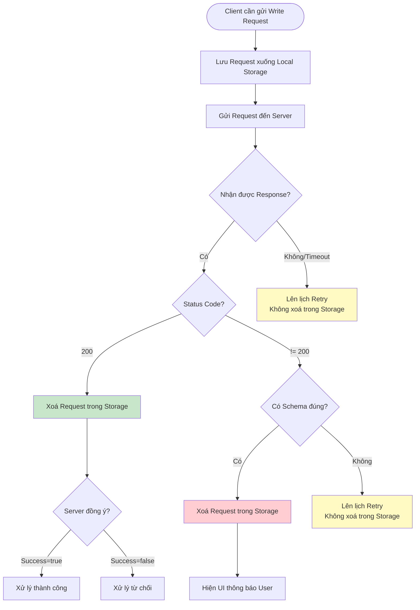
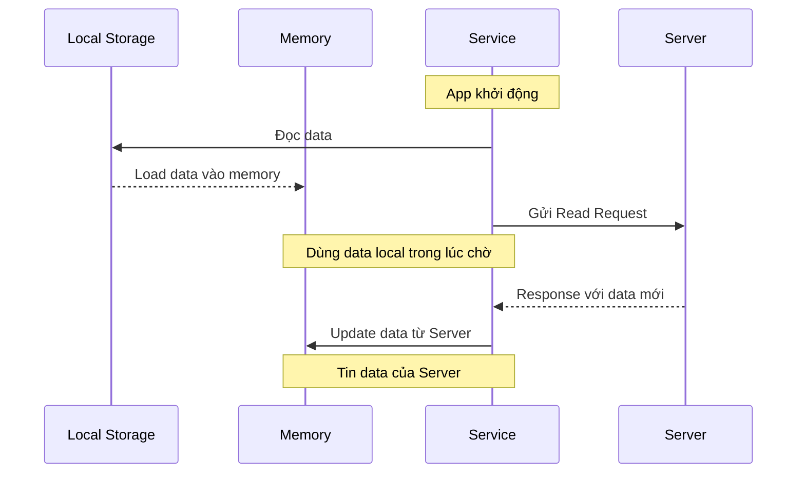
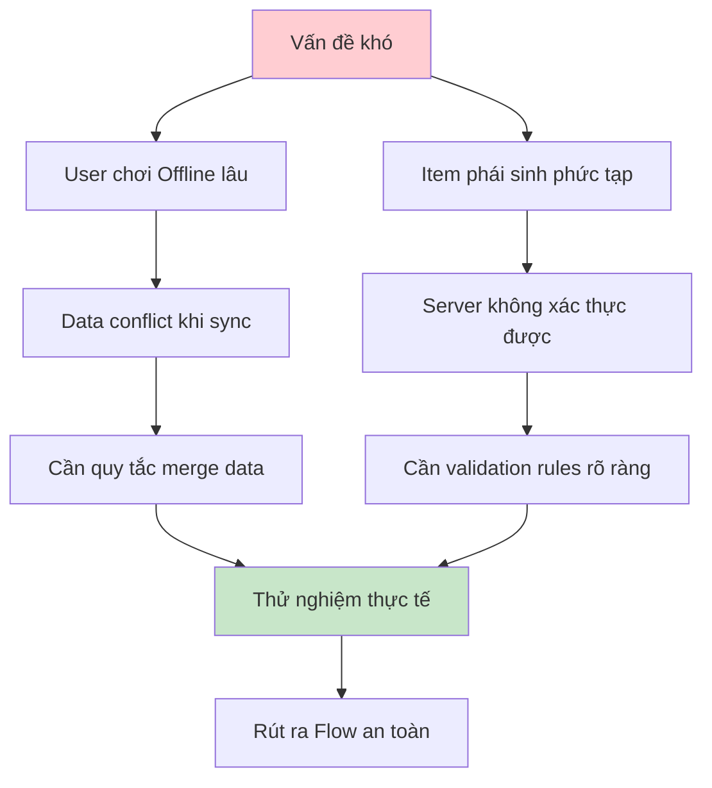

# Quy định giao tiếp Server-Client

## Mục tiêu thiết kế

- **Trải nghiệm liền mạch**: Không để việc giao tiếp với Server làm gián đoạn trải nghiệm của User
- **Offline-first**: Ưu tiên thiết kế App theo dạng Offline-first
- **Vai trò của Server**: Chỉ đảm bảo không gian lận và sync data khi sử dụng nhiều thiết bị

---

## 1. Các loại Request gửi lên Server

### Request Schema
Tất cả request đều sử dụng phương thức **POST** với payload schema:

```typescript
interface RequestPayload {
    type: string;      // Tên của handler cần gọi
    payload: object;   // Data gửi cho handler (kiểu object)
}
```

### Phân loại Request



#### Ví dụ cụ thể:
- **Read requests:**
  - Lấy balances của user (các currency, tiền trong account)
  - Lấy số lượng item của user (sneaker, fish, ...)

- **Write requests:**
  - Cộng thưởng cho user khi hoàn thành nhiệm vụ
  - Mua item abc
  - Fusion item abc

---

## 2. Quy định Response của Server

### Status Code



| Status Code | Ý nghĩa | Xử lý |
|------------|---------|-------|
| **200** | Server đã xử lý | Xem Response Schema bên dưới |
| **400** | Lỗi của Client (thiếu/sai data) | Client tự xử lý, không gửi lại |
| **401** | Chưa đăng nhập | Client phải đăng nhập lại |
| **500** | Lỗi bất ngờ của Server | Client có thể thử lại sau |

### Response Schema (Status 200)

```typescript
interface ServerResponse {
    success: boolean;           // true: server đồng ý | false: server từ chối
    error?: {                   // undefined khi success == true
        code: string;           // Error code cho đa ngôn ngữ (vd: "data_not_found")
        message: string;        // Error message cho developer
    };
    data?: object;             // undefined khi success == false
}
```

⚠️ **Lưu ý quan trọng:**
- Status Code **200**: Response Schema được đảm bảo đúng như trên
- Status Code **khác 200**: Response Schema có thể không đúng (ví dụ: lỗi đường truyền)

---

## 3. Cách Client phân loại Write Request

### Phân loại theo mức độ kiểm soát của Server



#### a. 🟢 Server không kiểm soát data
- **Đặc điểm**: Server ghi nhận và lưu tiến trình, thường luôn đồng ý
- **Xử lý Client**: Không cần Block UI, xử lý như Local Storage
- **Ví dụ**: Lưu progress game offline

#### b. 🟡 Server kiểm soát một phần data
- **Đặc điểm**: Server có thể từ chối để chống gian lận
- **Xử lý Client**: Không Block UI, delay kết quả cho đến khi có phản hồi
- **Ví dụ**: Nhận phần thưởng (chỉ nhận được 1 lần)

#### c. 🔴 Server kiểm soát hoàn toàn data
- **Đặc điểm**: Data quan trọng (Token, NFT, tiền Fiat)
- **Xử lý Client**: Phải chờ phản hồi Server, có thể Block UI hoặc Block một phần
- **Ví dụ**: Giao dịch tiền tệ, NFT

---

## 4. Cách Client xử lý Read Request



### Nguyên tắc:
- **Mục đích**: Sync data giữa Local Storage và Server
- **Ưu tiên**: Data của Server luôn là nguồn đáng tin cậy
- **Xử lý lỗi**: Client có thể tuỳ chọn retry hoặc không

---

## 5. Cách Client xử lý Write Request

### Luồng xử lý Write Request



### Quy tắc Retry

- **Thứ tự**: Gửi tuần tự từng request theo thứ tự (không gửi cùng lúc)
- **Ưu tiên**: Xử lý request retry trước các request mới
- **Persistence**: Luôn lưu Write Request xuống Storage để đảm bảo không mất khi app crash

---

## 6. Cách Client quản lý các Service liên quan đến Server

### a. Khi khởi động App



### b. Khi đang dùng App

#### Phân loại method trong Service:

| Method Pattern | Ý nghĩa | Khi nào dùng |
|---------------|---------|--------------|
| `async doSomething(data): Promise<data>` | Nên Block UI hoặc tuỳ chọn | Operations quan trọng |
| `doSomething(data, onCompleted: () => data)` | Block UI một phần | Operations trung bình |
| `registerEvent(eventName, onEventHappened: () => data)` | Không Block UI | Operations background |

---

## 7. Các vấn đề khó xử lý

### Tình huống phức tạp



### Giải pháp đề xuất:

1. **Conflict Resolution**: Xây dựng quy tắc merge data rõ ràng
2. **Validation Rules**: Định nghĩa rules validation cho từng loại item
3. **Testing**: Thử nghiệm kỹ các scenario edge case
4. **Monitoring**: Theo dõi và log các case bất thường để cải thiện

---

## Tổng kết

### Nguyên tắc vàng:
1. ✅ **Offline-first**: App phải hoạt động tốt cả khi không có mạng
2. ✅ **User Experience**: Không làm gián đoạn trải nghiệm người dùng
3. ✅ **Data Integrity**: Server là nguồn dữ liệu tin cậy cuối cùng
4. ✅ **Anti-cheat**: Server kiểm soát các data quan trọng
5. ✅ **Resilience**: Xử lý tốt các trường hợp lỗi và retry

### Best Practices:
- Luôn persist Write Request để đảm bảo không mất data
- Phân loại request theo mức độ quan trọng để xử lý UI phù hợp
- Sử dụng event-driven architecture cho các operations không quan trọng
- Test kỹ các scenario offline và conflict resolution