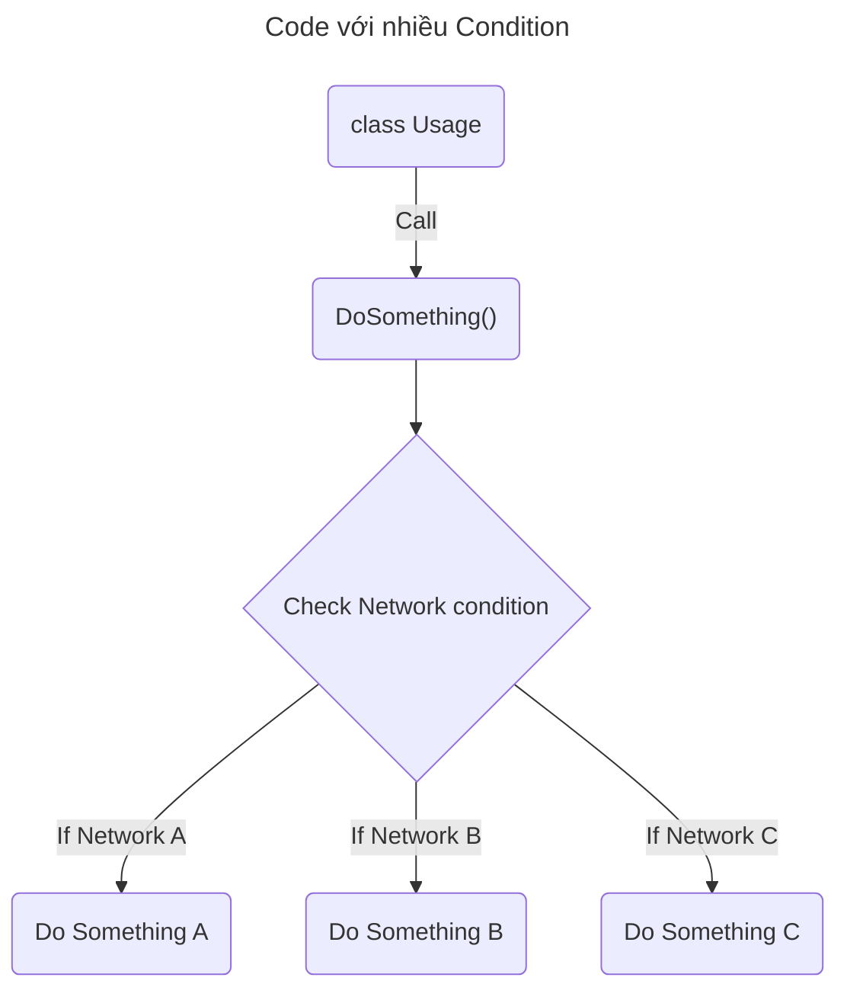
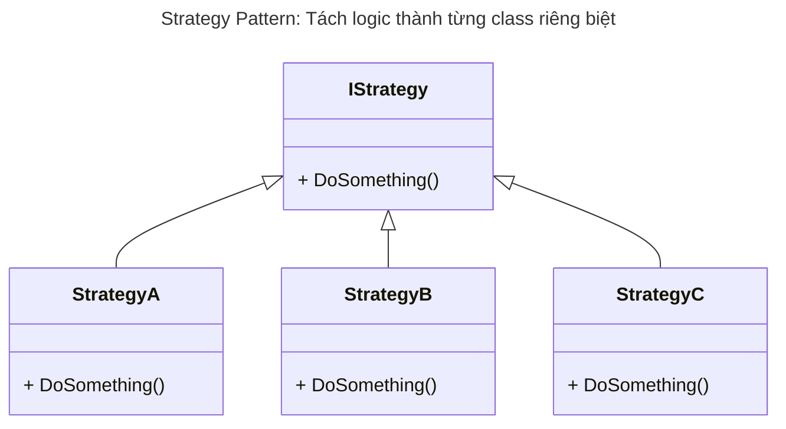

# Pattern Design: Strategy Pattern

- Sử dụng khi có nhiều logic code khác nhau và muốn chúng có thể thay đổi linh hoạt. Thay vì phải kiểm tra condition nhiều lần.
- Sử dụng hiệu quả hơn khi kèm với Factory Pattern, quyết định Strategy tại Factory & tất cả các object do Factory khởi tạo ra đều đã được chọn theo Strategy phù hợp.





Ví dụ:
```csharp
// Class cần Refactor
class Usage {
    void DoSomething() {
        if (IsNetworkA) {
            // Do something
        } else if (IsNetworkB) {
            // Do something
        } else {
            // Do something
        }
        // Do other things
    }
}

// ============================================

// Strategy Pattern style 1
interface IStrategy {
    void DoSomething
}

class StrategyA : IStrategy {
    void DoSomething() {
        // Do Strategy A
    }
}

class StrategyB : IStrategy {
    void DoSomething() {
        // Do Strategy B
    }
}

class StrategyC : IStrategy {
    void DoSomething() {
        // Do Strategy C
    }
}

class Usage {
    IStrategy strategy;
    
    constructor(Network network) {
        // Condition được quyết định 1 lần duy nhất tại Constructor, sau đó không cần quan tâm nữa
        
        if (network == Network.A) {
            strategy = new StrategyA();
        } else if (network == Network.B) {
            strategy = new StrategyB();
        } else {
            strategy = new StrategyC();
        }
    }
    
    void DoSomething() {
        strategy.DoSomething();
        // Do other things
    }
}

```