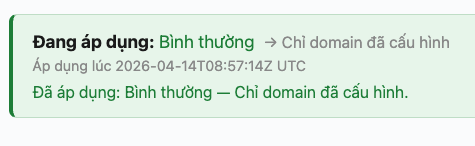
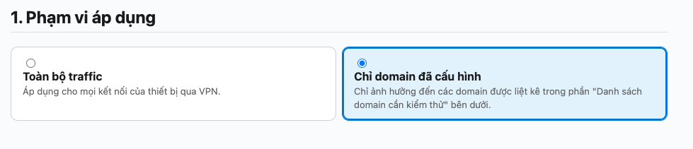
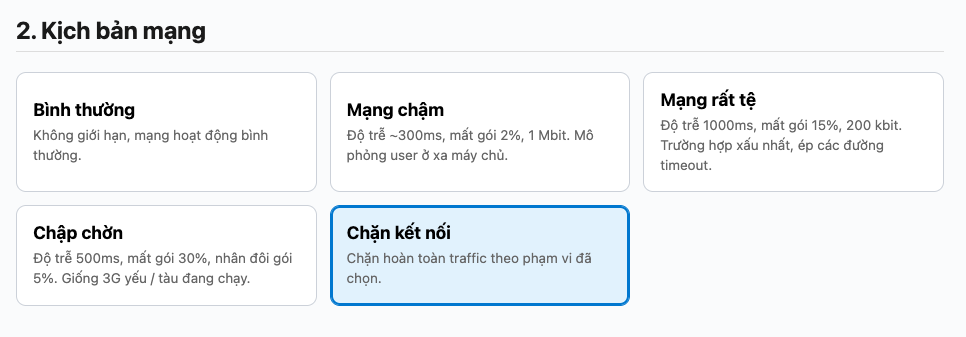
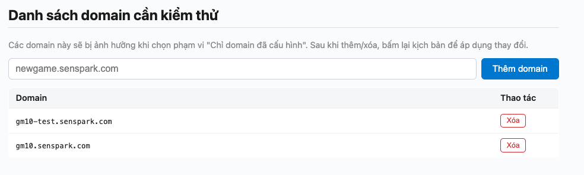

# Hướng dẫn sử dụng Senspark VPN:

## Bước 1: Cài WireGuard 
https://play.google.com/store/apps/details?id=com.wireguard.android

---

## Bước 2: Liên hệ Admin để đăng ký thiết bị
Admin sẽ giao cho 1 QR Code

---

## Bước 3: Quét QR Code
Trên giao diện của WireGuard: Bấm nút (+) và Quét QR code được Admin cung cấp.

Đặt tên Tunnel tuỳ ý.

QR code không thể được tái sử dụng ở nhiều thiết bị.

---

## Bước 4: Bật/tắt Tunnel
- Nếu bật ON: Device sẽ sử dụng VPN
- Nếu bật OFF: Device sử dụng mạng bình thường

---

## Bước 5: Truy cập trang cấu hình tốc độ mạng
Truy cập vào https://hm.senspark.com/ (dùng Wifi công ty mới vào được)

### Trạng thái hiện tại:

### Nhóm 1: Phạm vi áp dụng

- Toàn bộ traffic: sẽ chỉnh tốc độ mạng cho tất cả các kết nối internet
- Chỉ domain đã cấu hình: chỉ ảnh hưởng đến các kết nối đến các domain đã được liệt kê ở bên dưới. Các kết nối khác (Ads, Iap, lướt web ...) không bị ảnh hưởng

### Nhóm 2: Kịch bản mạng

- Chọn cái nào mong muốn

### Nhóm 3: Danh sách domain cần kiểm thử

- Domain nào trong danh sách này sẽ bị ảnh hưởng